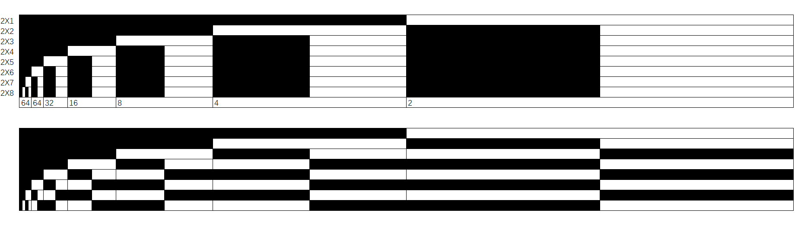

### five conversion
Traditional Chinese Philosophy  

**YINYANG**  

| name | color | boolean |Dimension |physics | Boson | fermion | equation | Plateonic| 
|:---:|:---:|:---:|:---|:---|:---|:---|:---|:---:|
| wood🌳|🟩|∞ |2D magnet| magnetic moment |Gravitational Force| proton | $\sin^{2}x+\cos^{2}y$|8|
| fire🔥|🔴|○ |2D electricity| spin|Strong Nuclear Force|electron| $x^{2}+y^{2}$ |4|
|earth🌏|🟨|∞ |torus | cosmos |Aether Force |atom | (θ; θ; 0) (1; θ; 2θ)|6|
|metal⚔️|⚪|○|3D electricity|gravity field |Weak Nuclear Force|neutrino | (sinθ, cosθ, θ) |12|
|water💧|⬛|∞ |3D magnet|magnetic field|Electromagnetic Force| neutron  | (θ; θ; θ) |20|
   
https://www.geogebra.org/3d/rbhmaxz8
